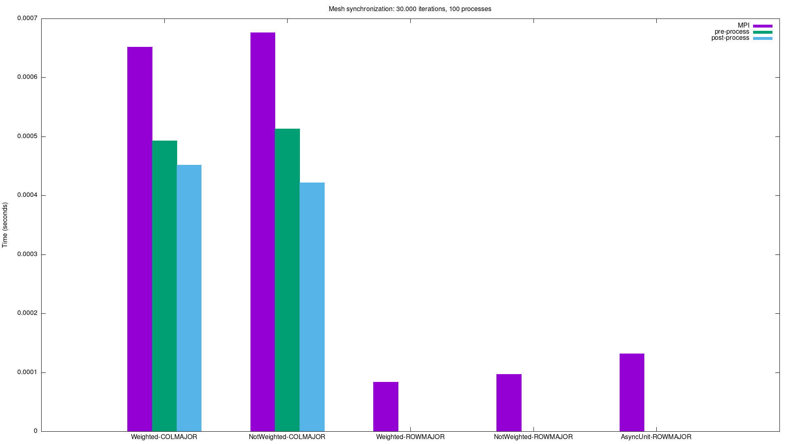
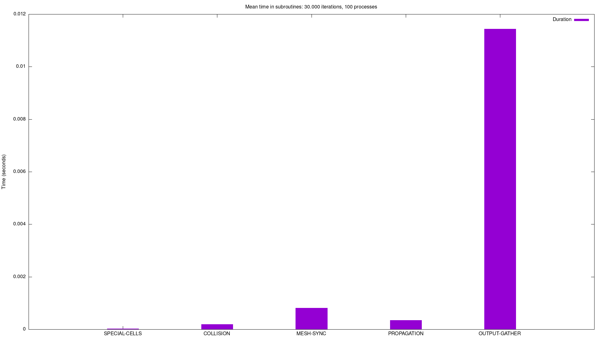
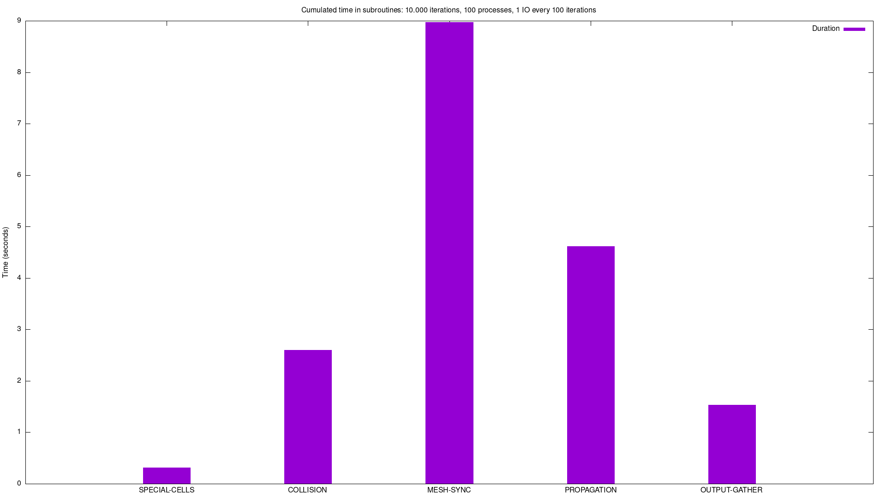

# Performance review

1. [Mesh synchronization](#mesh synchronization) (*lbm_comm_ghost_exchange*)
2. [I/O Meshes Gathering](#Meshes Gathering) (*save_frame_all_domain*)
3. [Subroutines](#subroutines)
4. [Threading](#threading)

---

## Mesh synchronization

```python
# Pre-processing
create_send_buffer()

# Mesh synchronization
MPI_synchronization_method()

# Post-processing
write_recv_buffer()
```



#### This graph represents the amount of time spent in the mesh synchronization, for each of the different mesh synchronization methods.

- **AyncUnit**: Sequence of Isend & Irecv operations, with a WaitAll at the end.
- **Weighted**: Graph_neighbour_Alltoallv operation, with a weighted graph communicator.
- **NotWeighted**: Graph_neighbour_Alltoallv operation, with a uniformly weighted graph communicator [1, ..., 1].

## Meshes Gathering

## Subroutines



#### This graph represents the _mean_ time spent in each of the main subroutines.



#### This graph represents the _cumulated_ time spent in each of the main subroutines.

nb: *OUTPUT-GATHER* refers to the time spent in the gathering of the output meshes only, not the I/O which is extremely
architecture-dependent.

## Threading