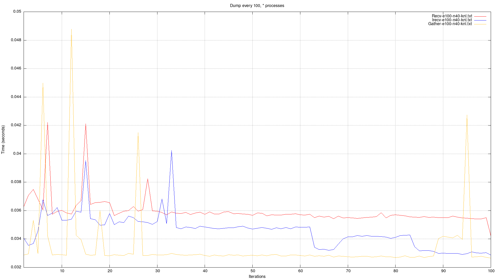
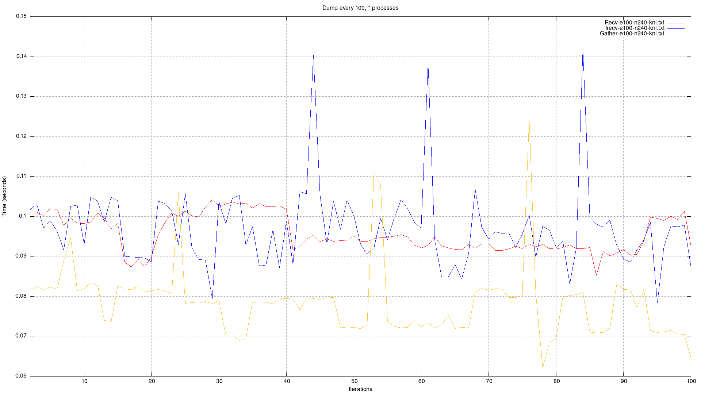
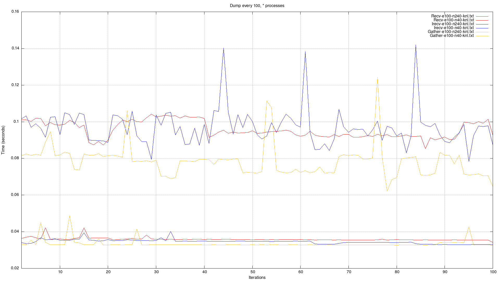

# Meshes output

## Methods:

1. `Recv`: Synchronous send & receive

```pseudocode
# Master task:
for each process (p):
    Recv mesh from process p
    Write mesh
    
# Sender task:
Send mesh to process Master
```

2. `Irecv`: Synchronous send & asynchronous receive

```pseudocode
# Master task:
for each process (p):
    Irecv mesh[p] from process p
for each process (p):
    Wait mesh[p] 
    Write mesh[p]
    
# Sender task:
Send mesh to process Master
```

3. `Gather`: Synchronous gather

```pseudocode
# Master task:
Gather all meshes from all processes
for each process (p):
    Write mesh[p]

# Sender task:
Send mesh to process Master
```

## Comparison

#### nb:

- These measurements were carried out on the `OB1-KNL01` node.
- The number of outputs was constant: 1 / 100 iterations.
- Total iterations: 1000.
- The first two iterations are not included in the measurements, as they are not representative of the performance.

### With 40 processes



### With 240 processes



### Combined plot



## Conclusion

As the full simulation requires to more process we can, we must focus on the method doing the better with a high number
of parallel process.

**Therefore, we will continue with the `Gather` method, which performs the better with 240 processes (and 40 also in
fact).**

## Notes

As the simulation requires a lot of output, we could try to separate the whole simulation in two areas, performing with
a delay of half the time between two outputs (better time balancing of disk usage). Each section would have its own
Master who's output would be in a private file. Then all Master's file would be merged at the end of the simulation.